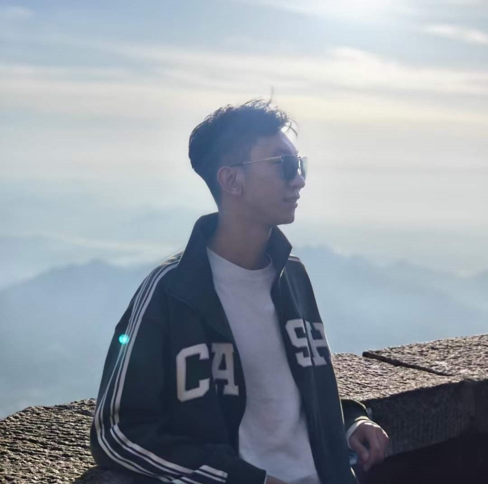

<nav class="navbar navbar-dark navbar-expand-lg fixed-top">
    

        <a href="https://ehandong.github.io">Home</a>
        <a href="#pub">Publications</a>
        <a href="#pub">Projects</a>
    

</nav>

# Haodong Zhu
<html>
<head>
<title>Font Awesome Icons</title>
<meta name="viewport" content="width=device-width, initial-scale=1">
<link rel="stylesheet" href="https://cdnjs.cloudflare.com/ajax/libs/font-awesome/4.7.0/css/font-awesome.min.css">
</head>
<body>
<a href="mailto:HaodongZhu@buaa.edu.cn"><i class="fa fa-fw fa-envelope" aria-hidden="true"></i> Email</a> &nbsp; 
<a href="https://scholar.google.com/citations?user=1nxTBxMAAAAJ&hl=zh-CN&authuser=1"><i class="fa fa-fw fa-graduation-cap"></i> Google Scholar</a>
</body>
</html> 

 

I am a PhD student at Beihang University, jointly trained at Zhongguancun Academy.  
Stay curious, upbeat, and resilient. Onward!  

##  Research Interests
Multimodal Learning, 3DGS, Foundation model.

## Honors & Activities 

Honors: Beihang University First-Class Scholarship; Outstanding Camper, 2025 Spring Camp, Zhongguancun Academy; Outstanding Graduate, Beihang University; Over 30 national and provincial awards during undergraduate study. 
Reviewer: AAAI(25), ICML(26) 

## Recent News

<ul>
<li> Jan 2026:  One paper is accepted to ICLR 2026. </li>
<li> Jun 2025:  One paper is accepted to ICCV 2025. </li>
<li> Apr 2025: I have joined Zhongguancun Academy. </li>
<li> Feb 2025: One paper is accepted to IEEE Transactions on Multimedia. </li>
<li> Sep 2024: I have just started my PhD studies in Artificial Intelligence at Beihang University. </li>
</ul>

## Publications [[Preprint](#Preprint) - [2026](#pub2026) ]

<h3 id="Preprint">Preprint</h3>

- Surf3R: Rapid Surface Reconstruction from Sparse RGB Views in Seconds 
**Haodong Zhu**\#, Changbai Li\#, Yangyang Ren, Zichao Feng, Xuhui Liu, Hanlin Chen, Xiantong Zhen, Baochang Zhang 
*arXiv*, 2025. 
[[arXiv]](https://www.arxiv.org/abs/2508.04508)

- Squeeze10-LLM: Squeezing LLMs' Weights by 10 Times via a Staged Mixed-Precision Quantization Method 
Qingcheng Zhu, Yangyang Ren, Linlin Yang, Mingbao Lin, Yanjing Li, Sheng Xu, Zichao Feng, **Haodong Zhu**, Yuguang Yang, Juan Zhang, Runqi Wang, Baochang Zhang 
*arXiv*, 2025. 
[[arXiv]](https://www.arxiv.org/pdf/2507.18073)

- HRGS: Hierarchical Gaussian Splatting for Memory-Efficient High-Resolution 3D Reconstruction 
Changbai Li\#, **Haodong Zhu**\#, Hanlin Chen, Juan Zhang, Tongfei Chen, Shuo Yang, Shuwei Shao, Wenhao Dong, Baochang Zhang 
*arXiv*, 2025. 
[[arXiv]](https://arxiv.org/pdf/2506.14229?)

<h3 id="pub2026">2026</h3>

- UrbanGS: Efficient and Scalable Architecture for Geometrically Accurate Large-Scene Reconstruction 
Changbai Li\#, **Haodong Zhu**\#, Hanlin Chen, Xiuping Liang, Tongfei Chen, Shuwei Shao, Linlin Yang, Huobin Tan, Baochang Zhang 
*International Conference on Learning Representations (ICLR)*, 2026. 

<h3 id="pub2025">2025</h3>

- WaveMamba: Wavelet-Driven Mamba Fusion for RGB-Infrared Object Detection 
**Haodong Zhu**\#, Wenhao Dong\#, Linlin Yang, Hong Li, Yuguang Yang, Yangyang Ren, Qingcheng Zhu, Zichao Feng, Changbai Li, Shaohui Lin, Runqi Wang, Xiaoyan Luo\*, Baochang Zhang 
*International Conference on Computer Vision (ICCV)*, 2025. 
[[arXiv]](https://www.arxiv.org/pdf/2507.18173) 

- Fusion-mamba for cross-modality object detection 
Wenhao Dong\#, **Haodong Zhu**\#, Shaohui Lin, Xiaoyan Luo, Yunhang Shen, Xuhui Liu, Juan Zhang, Guodong Guo, Baochang Zhang 
*IEEE Transactions on Multimedia*, 2025. 
[[arXiv]](https://arxiv.org/pdf/2404.09146) 

